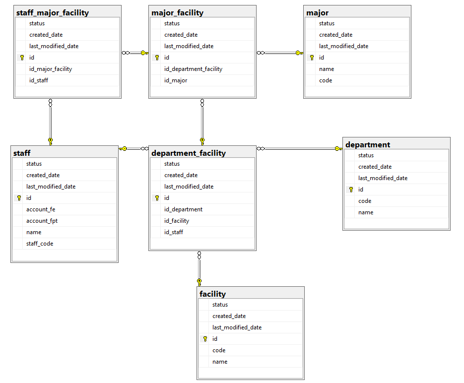

### Employee Management System

A comprehensive Spring Boot application for managing employees, departments, facilities, and specializations. This
system allows organizations to track employee information, manage their specializations across different facilities, and
handle data import/export operations.

## Technologies Used

- **Java 17**
- **Spring Boot 3.4.4**
- **Spring Data JPA**
- **Thymeleaf** for server-side templating
- **Bootstrap 5** for responsive UI
- **jQuery** for AJAX operations
- **Microsoft SQL Server** for database
- **Apache POI** for Excel file operations
- **Lombok** for reducing boilerplate code
- **ModelMapper** for DTO conversions

## Database Schema

The application uses the following database schema:

## Sơ Đồ Cơ Sở Dữ Liệu



## Features

### Staff Management

- Create, read, update, and delete staff records
- Track staff information including name, code, and email addresses
- Toggle staff active status

### Facility and Department Management

- Manage facilities (campuses) and departments
- Associate departments with facilities
- Assign department heads

### Specialization Management

- Manage specializations (majors) across departments
- Assign staff to specializations at specific facilities
- Track staff specialization history

### Data Import/Export

- Import staff data from Excel files
- Export staff data to Excel format
- Track import history and errors

### User Interface

- Responsive web interface using Bootstrap
- Interactive forms with client-side validation
- AJAX-based operations for smooth user experience

## Setup and Installation

### Prerequisites

- Java 17 or higher
- Microsoft SQL Server
- Maven

### Database Setup

1. Create a SQL Server database named `exam_distribution_test`
2. Run the SQL script provided in the `database-setup.sql` file to create the necessary tables and sample data

### Application Configuration

1. Clone the repository
2. Configure the database connection in `src/main/resources/application.properties`:

```plaintext
spring.datasource.url=jdbc:sqlserver://localhost:1433;databaseName=exam_distribution_test;encrypt=true;trustServerCertificate=true
spring.datasource.username=your_username
spring.datasource.password=your_password
```

3. Build the application:

```shellscript
mvn clean package
```

4. Run the application:

```shellscript
java -jar target/StaffSync-0.0.1-SNAPSHOT.jar
```

5. Access the application at `http://localhost:8080`

## API Endpoints

### Staff API

- `GET /api/staff` - Get all staff
- `GET /api/staff/{id}` - Get staff by ID
- `GET /api/staff/code/{code}` - Get staff by code
- `POST /api/staff` - Create new staff
- `PUT /api/staff/{id}` - Update staff
- `PUT /api/staff/{id}/toggle-status` - Toggle staff status

### Specialization API

- `GET /api/specializations/facilities` - Get all facilities
- `GET /api/specializations/departments/{facilityId}` - Get departments by facility
- `GET /api/specializations/majors/{departmentFacilityId}` - Get majors by department facility
- `GET /api/specializations/staff/{staffId}` - Get staff specializations
- `POST /api/specializations/staff/{staffId}` - Add staff specialization
- `DELETE /api/specializations/{id}` - Remove staff specialization

### Excel API

- `GET /api/excel/template` - Download Excel template
- `POST /api/excel/import` - Import staff data
- `GET /api/excel/import-history` - Get import history

## Project Structure

```plaintext
src/main/java/com/fpt/employeemanagement/
├── config/                  # Configuration classes
├── controller/              # REST and view controllers
├── dto/                     # Data Transfer Objects
├── exception/               # Exception handling
├── Entity/                   # Entity classes
├── repository/              # JPA repositories
├── service/                 # Business logic
└── StaffSync.java  # Main application class

src/main/resources/
├── static/                  # Static resources (CSS, JS)
├── templates/               # Thymeleaf templates
└── application.properties   # Application configuration
```

## Screenshots

### Staff List

### Staff Form

### Specialization Management

### Import/Export

## License

This project is licensed under the MIT License - see the LICENSE file for details.

## Acknowledgements

- Spring Boot and Spring Data JPA for the robust backend framework
- Bootstrap for the responsive UI components
- jQuery for simplifying client-side scripting
- Apache POI for Excel file handling

---

© 2025 Tran Viet Vuong. All rights reserved.
